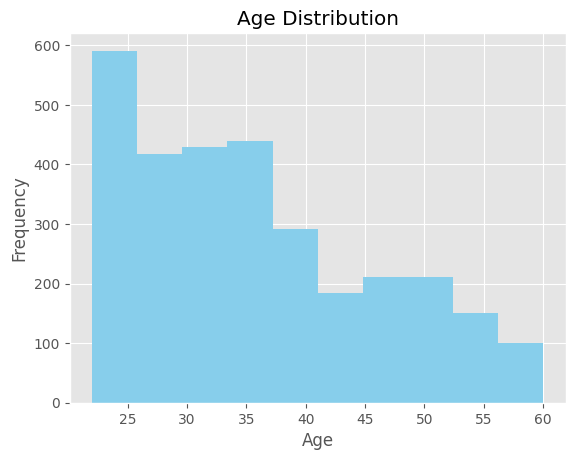

**Objectives**

- Access the data set
- clean or organise the dataset
- EDA
- visual representation
- Conclusion of the analysis
  **Graph**
   
  **Age distribution**
  
   
  **Commute mode distribution**
  
   
  **Sleep Hour Distribution**
  
   
  **Job satisfaction by gender**
  
   
  **Avg experience by Job Level**
  
